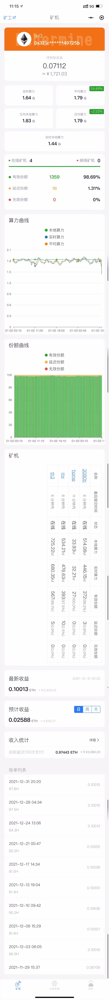
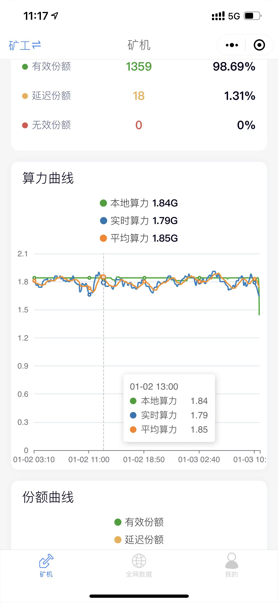
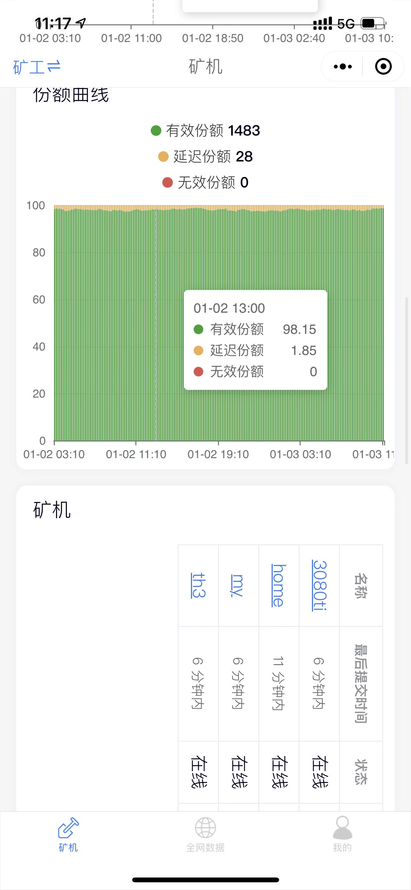
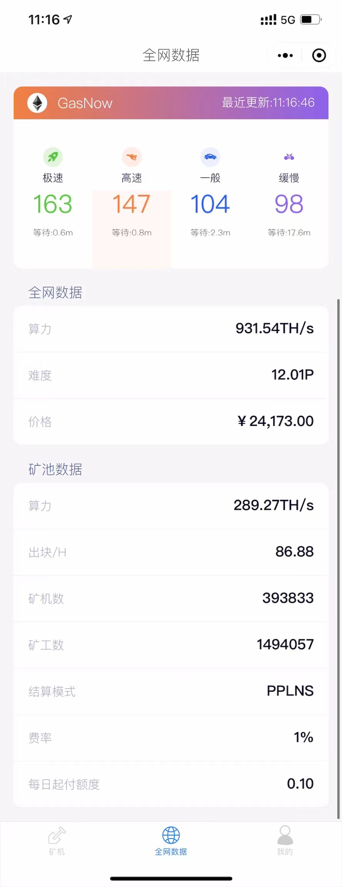
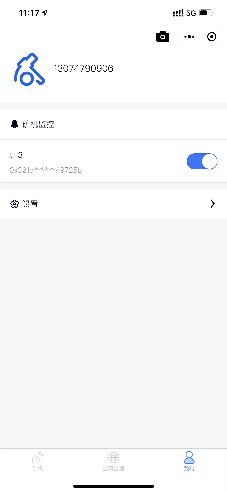
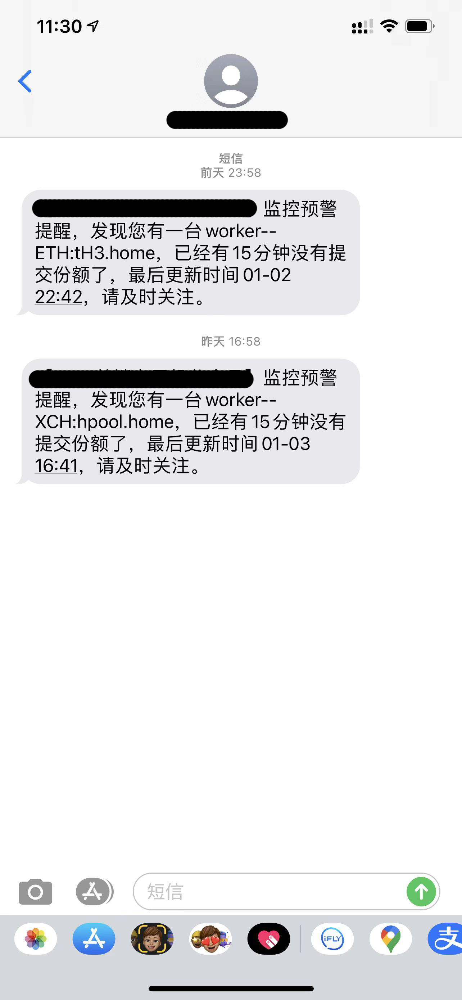

# E池监控程序

ethermine监控软件，可以发布为小程序，后续h5和APP正在开发中，基于前端基于uni-app，后端基于eggjs，可直接打包部署，效果图如下。

主要功能点
- **矿工基本概况**
- **监控算力**

    >1. 本地算力
    >2. 实时算力
    >3. 实时本地算力
    >4. 日均算力
    >5. 日均本地算力
- **矿机及份额概览**
- **算力曲线**
- **份额曲线**
- **矿机列表**
- **最新收益**
- **预计收益**
    >1. 预计日收益
    >2. 预计周收益
    >3. 预计月收益

- **收入统计**
- **账单列表**

- **GAS-now**
- **全网及矿池数据**
- **矿机监控(掉线短信提示)**
- **Hpool矿机监控(掉线短信提示)**

